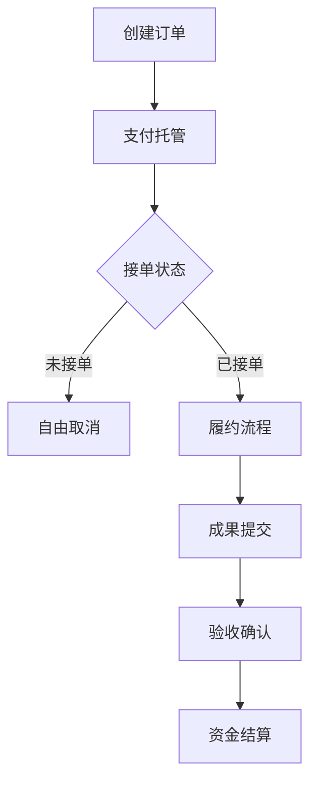

# 付费知识问答平台产品计划书

## 一、产品定位
**目标用户**：学生群体（本硕博）、技术从业者（程序员/工程师）、科研人员、创意工作者  
**核心价值**：基于实名认证的高质量知识服务交易平台，构建可信赖的智慧资源共享生态

## 二、系统架构设计
### 1. 用户管理模块
- **分层认证体系**：
  - 基础认证（手机+邮箱）
  - 进阶认证（学生证/工牌+活体验证）
  - 企业认证（工作邮箱+企业执照）
- **双维度信用体系**：
  - 专业分（学科标签/项目完成率/用户评价）
  - 诚信分（履约率/纠纷记录）

### 2. 订单交易模块
#### 订单生命周期管理：


#### 智能定价建议：
- 价格计算器（基于任务类型/复杂度/紧急程度提供参考价）
- 历史成交数据可视化（同类任务价格分布图）

### 3. 争议处理机制
**四阶解决方案**：
1. 智能协商（系统自动匹配聊天记录+文件证据）
2. 专家评审（平台认证的领域专家仲裁）
3. 平台仲裁（客服团队介入调查）
4. 保证金冻结（争议期间资金暂存）

**自动监控系统**：
- 敏感词过滤（检测私下联系方式）
- 会话异常预警（高频离线沟通触发审核）
- 履约进度跟踪（设置里程碑检查点）

### 4. 支付清算系统
**资金流设计**：
```
用户充值 → 平台托管 → 服务完成 → 扣除手续费 → 结算到账
```
- 手续费模型：阶梯费率（单笔≤100元收20%，100-500收15%，＞500收10%）
- 风险准备金：每笔交易留存2%作为纠纷保障金

### 5. 安全防护体系
- 关键数据加密：AES-256加密敏感信息
- 行为审计追踪：记录完整操作日志
- 双因子认证：涉及资金操作时强制验证

## 三、核心业务流程
### 1. 订单创建流程
```
用户输入需求 → 智能标签生成 → 价格评估建议 → 选择支付方式 → 资金冻结 → 订单发布
```

### 2. 服务交付流程
```
接单确认 → 建立安全沟通通道 → 定期进度反馈 → 成果加密提交 → 双向评价 → 资金解冻
```

## 四、技术实现方案
### 1. 技术栈选择
- 前端：React+TypeScript
- 后端：Spring Cloud微服务架构
- 数据库：MySQL集群+Redis缓存
- 文件存储：阿里云OSS
- 即时通讯：WebSocket+Socket.IO

### 2. 关键接口设计
- 身份认证API（对接学信网/企业工商系统）
- 支付网关（集成支付宝/微信/银联）
- 内容安全审核（接入阿里云内容安全服务）

## 五、运营策略
### 1. 冷启动方案
- 高校推广计划（联合实验室/学术社团）
- 技术社区合作（CSDN/掘金/GitHub）
- 专家邀请制（领域KOL专属邀请码）

### 2. 风控机制
- 接单准入门槛：专业分≥80且诚信分≥90
- 交易限额控制：新用户首月累计交易≤5000元
- 黑名单共享：建立行业反欺诈数据库

## 六、项目里程碑
| 阶段 | 时间 | 交付物 |
|------|------|--------|
| 需求确认 | 1-2周 | PRD文档/原型设计 |
| 系统开发 | 12周 | 核心功能MVP |
| 内测优化 | 4周 | Beta测试报告 |
| 正式上线 | 2周 | 运营体系搭建 |

## 七、法律合规
1. 增值电信业务许可证（ICP）
2. 在线数据处理与交易处理业务（EDI）
3. 网络安全等级保护备案（三级等保）
4. 用户隐私协议（GDPR合规）

---

该方案在保障交易安全的前提下，通过技术手段构建可信服务环境。建议首期聚焦细分领域（如编程开发/学术论文），建立标杆案例后逐步扩展生态。需要特别注意资金池监管问题，建议与持牌支付机构合作开展资金存管业务。
